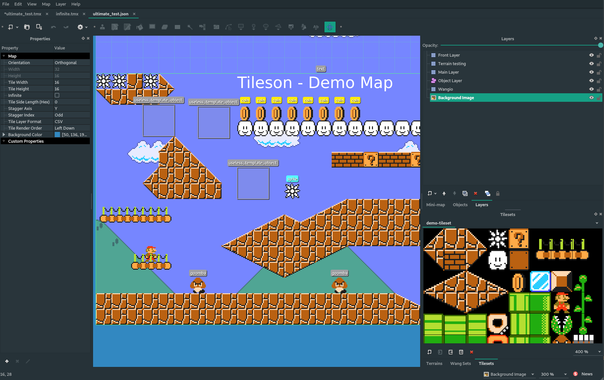
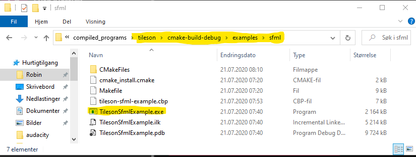
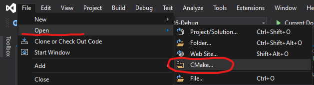
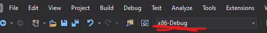
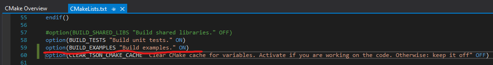
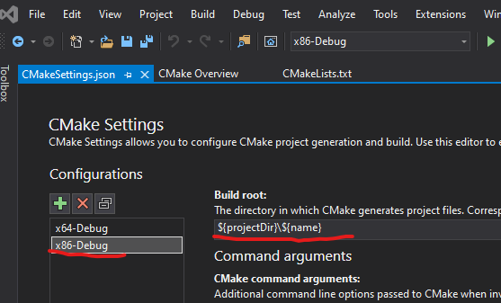
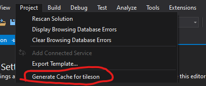
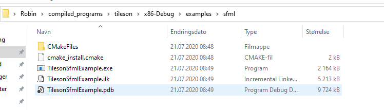

[](https://github.com/SSBMTonberry/tileson/actions/workflows/ci-windows-msvc.yml)
[](https://github.com/SSBMTonberry/tileson/actions/workflows/ci-linux-gcc.yml)
[](https://github.com/SSBMTonberry/tileson/actions/workflows/ci-linux-clang.yml)
[](https://github.com/SSBMTonberry/tileson/actions/workflows/ci-macos-clang.yml)
[](https://github.com/SSBMTonberry/tileson/actions/workflows/pages/pages-build-deployment)

# Tileson
Tileson is a modern and helpful cross-platform json-parser for C++, used for parsing Tiled maps.

Tileson utilizes modern C++ (C++17) to create a stable, safe and helpful, but fast, parser for Tiled maps.
Including classes and functions to make it easier to use the Tiled data in your game. 
Tileson supports Tiled maps up to version `1.10.2`, but will probably be able to parse
maps made with newer versions of Tiled just as well.

Be sure to take a look at the release notes to see what's new!

### Tileson is header-only
This means that all you need is one file, `tileson.hpp` to have Tileson going
in your project! The single-file is generated using only ~7000 lines of code with everything included. There is also a `tileson_min.hpp` where no Json parser is bundled. See the `extras` folder for supported Json backends.

You may alternatively copy the `include` directory and all its contents if you
want to have every component in their own file. This will probably be less heavy on your IDE, but you will still only need to include the `tileson.h` file in the top level.

**Content:**
- [Tileson](#tileson)
    - [Tileson is header-only](#tileson-is-header-only)
- [Documentation](#documentation)
    - [IMPORTANT: Tileson requires that everything it needs in a map is embedded into it, to be able to resolve their related objects (with the exception of external Tilesets, which is supported in json format since v1.3.0). Maps having dependencies to external objects etc. will not work properly.](#important-tileson-requires-that-everything-it-needs-in-a-map-is-embedded-into-it-to-be-able-to-resolve-their-related-objects-with-the-exception-of-external-tilesets-which-is-supported-in-json-format-since-v130-maps-having-dependencies-to-external-objects-etc-will-not-work-properly)
- [How to contribute](#how-to-contribute)
- [Unreleased features available in the master-branch](#unreleased-features-available-in-the-master-branch)
- [What is new in v1.4.0](#what-is-new-in-v140)
- [Tiled features not yet supported](#tiled-features-not-yet-supported)
- [What is Tiled?](#what-is-tiled)
- [How to parse Tiled maps](#how-to-parse-tiled-maps)
    - [Another quick example to showcase how to get data that can be used to produce drawable objects:](#another-quick-example-to-showcase-how-to-get-data-that-can-be-used-to-produce-drawable-objects)
    - [Parsing worlds](#parsing-worlds)
    - [Parsing Tiled-projects](#parsing-tiled-projects)
    - [Using Tiled's class and enum types in Tiled-projects](#using-tileds-class-and-enum-types-in-tiled-projects)
    - [Parsing LZMA compressed maps](#parsing-lzma-compressed-maps)
    - [Using an alternative Json parser](#using-an-alternative-json-parser)
- [Compiling](#compiling)
  - [Windows](#windows)
      - [Locate the CMakeLists.txt in the root of this project](#locate-the-cmakeliststxt-in-the-root-of-this-project)
      - [Configure build to be x86 or x64](#configure-build-to-be-x86-or-x64)
      - [And then](#and-then)
      - [Output after full build](#output-after-full-build)
  - [Linux](#linux)
  - [OSX](#osx)
- [Examples](#examples)
- [Generating the single-header](#generating-the-single-header)
- [Libraries used by Tileson](#libraries-used-by-tileson)
  - [Optional Json parsers supported by Tileson](#optional-json-parsers-supported-by-tileson)
- [Libraries used in examples](#libraries-used-in-examples)

# Documentation

There is a `Doxygen` generated documentation of Tileson that can be found [HERE](https://ssbmtonberry.github.io/tileson/html)

### IMPORTANT: Tileson requires that everything it needs in a map is embedded into it, to be able to resolve their related objects (with the exception of external Tilesets, which is supported in json format since v1.3.0). Maps having dependencies to external objects etc. will not work properly.

# How to contribute
You are free to post any issue requesting new features, reporting bugs or asking questions at any time.
If you want to contribute in the development of `Tileson`, make sure you read the [CONTRIBUTION GUIDELINES](CONTRIBUTION.md) before you start doing anything.

# Unreleased features available in the master-branch
- Added support for `Image Collection Tilesets` ([#117](https://github.com/SSBMTonberry/tileson/pull/117), [#30](https://github.com/SSBMTonberry/tileson/issues/30)) - Thanks to [twje](https://github.com/twje)
- Fix: Demo - Tiles rotated to 90 and 270 degrees display incorrectly ([#116](https://github.com/SSBMTonberry/tileson/pull/116)) - Thanks to [twje](https://github.com/twje)
- Generated tiles are now considering local IDs ([#112](https://github.com/SSBMTonberry/tileson/pull/112), [#114](https://github.com/SSBMTonberry/tileson/pull/114)) - Thanks to [twje](https://github.com/twje)
- `Tile::getDrawingRect()` is now based on tile grid size (previously map grid size) ([#109](https://github.com/SSBMTonberry/tileson/pull/109)) - Thanks to [tmpsantos](https://github.com/tmpsantos)
- A new function `Tileset::getFullImagePath()` to retrieve a full path to an image based on the loaded map. `Tileset::getImagePath()` still returns a relative path. ([#107](https://github.com/SSBMTonberry/tileson/pull/107)) - Thanks to [tmpsantos](https://github.com/tmpsantos)
- Attributes of classes set as properties return zero where overridden ([#105](https://github.com/SSBMTonberry/tileson/pull/105)) - Thanks to [tmpsantos](https://github.com/tmpsantos)

# What is new in v1.4.0
- Fixed bug where template objects did not correctly override properties ([#100](https://github.com/SSBMTonberry/tileson/pull/100)) - Thanks to [jpeletier](https://github.com/jpeletier)
- Fixed bugs related to not being able to resolve `TiledEnum`s in certain contexts ([#98](https://github.com/SSBMTonberry/tileson/pull/98))
- Fix: Only include `external_libs` folder if examples or tests are required ([#96](https://github.com/SSBMTonberry/tileson/pull/96)) - Thanks to [Laguna1989](https://github.com/Laguna1989)
- Tests are now stricter and treats warnings as errors ([#90](https://github.com/SSBMTonberry/tileson/pull/90)) - Thanks to [dmlary](https://github.com/dmlary)
- CI improvements: Added `MacOS`, separated CI by system and added Clang 12 and 13 support on Linux ([#88](https://github.com/SSBMTonberry/tileson/pull/88))
- Fixed some Apple Clang 13 compile warnings ([#84](https://github.com/SSBMTonberry/tileson/issues/84)) - Thanks to [dmlary](https://github.com/dmlary)
- Added `quom` as amalgamate tool for `OSX` ([#82](https://github.com/SSBMTonberry/tileson/issues/82)) - Thanks to [dmlary](https://github.com/dmlary)
- Added missing properties to `tson::Text` ([#75](https://github.com/SSBMTonberry/tileson/issues/75))
- Tiled 1.9 support ([#68](https://github.com/SSBMTonberry/tileson/issues/68))
- Tiled 1.8 support ([#60](https://github.com/SSBMTonberry/tileson/issues/60))
- C++20 support ([#53](https://github.com/SSBMTonberry/tileson/issues/53)) - Thanks to [gamecoder-nz](https://github.com/gamecoder-nz)
- Updated Catch2 to support `GCC 11.2` ([#59](https://github.com/SSBMTonberry/tileson/issues/59))
- Tile properties should now be properly loaded when using multiple tilesets. ([#54](https://github.com/SSBMTonberry/tileson/issues/54)) - Thanks to [Laguna1989](https://github.com/Laguna1989)
- Now using `Github Actions` instead of `Travis` for CI ([#50](https://github.com/SSBMTonberry/tileson/issues/50)) - Thanks to [Laguna1989](https://github.com/Laguna1989)
- Added missing virtual destructor to IJson and IDecompressor. ([#47](https://github.com/SSBMTonberry/tileson/issues/47)) - Thanks to [matthew-nagy](https://github.com/matthew-nagy)

# Tiled features not yet supported
- Isometric maps are untested, and most likely does not work 100% ([#97](https://github.com/SSBMTonberry/tileson/issues/97))

# What is Tiled?
Tiled is a general purpose map editor developed by `Thorbjørn Lindeijer`.
Tiled is perfect if you want to create any map for 2D games, and is very popular.
Many commercial games have used it as their goto map editor. 
A few popular games that have used Tiled: `Shovel Knight`, `Axiom Verge` and `ScubaDiver`.


 

Tiled can be found here:
- [Homepage](https://www.mapeditor.org/)
- [GitHub](https://github.com/bjorn/tiled)

# How to parse Tiled maps
Parsing a Tiled json 
```c++
#include "tileson.hpp"

//Tileson uses an alias fs for std::filesystem.
int main()
    tson::Tileson t;
    std::unique_ptr<tson::Map> map = t.parse(tson_files::_ULTIMATE_TEST_JSON, tson_files::_ULTIMATE_TEST_JSON_SIZE);

    if(map->getStatus() == tson::ParseStatus::OK)
    {
        //Get color as an rgba color object
        tson::Colori bgColor = map->getBackgroundColor(); //RGBA with 0-255 on each channel

        //This color can be compared with Tiled hex string
        if (bgColor == "#ffaa07")
            printf("Cool!");

        //Or you can compare them with other colors
        tson::Colori otherColor{255, 170, 7, 255};
        if (bgColor == otherColor)
            printf("This works, too!");

        //You can also get the color as float, transforming values if they are already in their int form, from max 255 to 1.f
        tson::Colorf bgColorFloat = bgColor.asFloat();

        //Or the other way around
        tson::Colori newBg = bgColorFloat.asInt();

        //You can loop through every container of objects
        for (auto &layer : map->getLayers())
        {
            if (layer.getType() == tson::LayerType::ObjectGroup)
            {
                for (auto &obj : layer.getObjects())
                {
                    //Just iterate through all the objects
                }
                //Or use these queries:

                //Gets the first object it finds with the name specified
                tson::Object *player = layer.firstObj("player"); //Does not exist in demo map->..

                //Gets all objects with a matching name
                std::vector<tson::Object> enemies = layer.getObjectsByName("goomba"); //But we got two of those

                //Gets all objects of a specific type
                std::vector<tson::Object> objects = layer.getObjectsByType(tson::ObjectType::Object);

                //Gets an unique object by its name.
                tson::Object *uniqueObj = layer.getObj(2);
            }
        }

        //Or get a specific object if you know its name (or id)
        tson::Layer *layer = map->getLayer("Main Layer");
        tson::Tileset *tileset = map->getTileset("demo-tileset");
        tson::Tile *tile = tileset->getTile(1); //Tileson tile-IDs starts with 1, to be consistent
        // with IDs in data lists. This is in other words the
        //first tile.

        //For tile layers, you can get the tiles presented as a 2D map by calling getTileData()
        //Using x and y positions in tile units.
        if(layer->getType() == tson::LayerType::TileLayer)
        {
            //When the map is of a fixed size, you can get the tiles like this
            if(!map->isInfinite())
            {
                std::map<std::tuple<int, int>, tson::Tile *> tileData = layer->getTileData();

                //Unsafe way to get a tile
                tson::Tile *invalidTile = tileData[{0, 4}]; // x:0,  y:4  - There is no tile here, so this will be nullptr.
                                                                   // Be careful with this, as it expands the map with an ID of {0,4} pointing
                                                                   // to a nullptr...

                //Individual tiles should be retrieved by calling the safe version:
                tson::Tile *safeInvalid = layer->getTileData(0, 5); //Another non-existent tile, but with safety check.
                                                                         //Will not expand the map with a nullptr

                tson::Tile *tile1 = layer->getTileData(4, 4);       //x:4,  y:4  - Points to tile with ID 1 (Tiled internal ID: 0)
                tson::Tile *tile2 = layer->getTileData(5, 4);       //x:5,  y:4  - Points to tile with ID 3 (Tiled internal ID: 2)
                tson::Tile *tile3 = layer->getTileData(8, 14);      //x:8,  y:14 - Points to tile with ID 2 (Tiled internal ID: 1)
                tson::Tile *tile4 = layer->getTileData(17, 5);      //x:17, y:5  - Points to tile with ID 5 (Tiled internal ID: 4)

                //New in v1.2.0
                //You can now get tiles with positions and drawing rect via tson::TileObject
                //Drawing rects are also accessible through tson::Tile.
                tson::TileObject *tileobj1 = layer->getTileObject(4, 4);
                tson::Vector2f position = tileobj1->getPosition();
                tson::Rect drawingRect = tileobj1->getDrawingRect();

                //You can of course also loop through every tile!
                for (const auto &[id, tile] : tileData)
                {
                    //Must check for nullptr, due to how we got the first invalid tile (pos: 0, 4)
                    //Would be unnecessary otherwise.
                    if(tile != nullptr)
                        int tileId = tile->getId(); //A bit verbose, as this is the same as id from the key, but you get the idea.
                }
            }
        }

        //If an object supports properties, you can easily get a property value by calling get<T>() or the property itself with getProp()
        int myInt = layer->get<int>("my_int");
        float myFloat = layer->get<float>("my_float");
        bool myBool = layer->get<bool>("my_bool");
        std::string myString = layer->get<std::string>("my_string");
        tson::Colori myColor = layer->get<tson::Colori>("my_color");

        fs::path file = layer->get<fs::path>("my_file");

        tson::Property *prop = layer->getProp("my_property");
    }
    else //Error occured
    {
        std::cout << map->getStatusMessage();
    }

    return 0;
}
```

### Another quick example to showcase how to get data that can be used to produce drawable objects:
```c++
tson::Tileson t;
std::unique_ptr<tson::Map> map = t.parse(fs::path("./path/to/map.json"));

if(map->getStatus() == tson::ParseStatus::OK)
{
    //Gets the layer called "Object Layer" from the "ultimate_demo.json map
    tson::Layer *objectLayer = map->getLayer("Object Layer"); //This is an Object Layer

    //Example from an Object Layer.
    if(objectLayer->getType() == tson::LayerType::ObjectGroup)
    {
        tson::Object *goomba = objectLayer->firstObj("goomba"); //Gets the first object with this name. This can be any object.

        //If you want to just go through every existing object in the layer:
        for(auto &obj : objectLayer->getObjects())
        {
            tson::Vector2i position = obj.getPosition();
            tson::Vector2i size = obj.getSize();
            tson::ObjectType objType = obj.getObjectType();

            //You may want to check the object type to make sure you use the data right.
        }

        tson::ObjectType objType = goomba->getObjectType();

        /*!
         * tson::ObjectType is defined like this.
         * They are automatically detected based on what kind of object you have created
         * enum class Type : uint8_t
            {
                Undefined = 0,
                Object = 1,
                Ellipse = 2, //<-- Circle
                Rectangle = 3,
                Point = 4,
                Polygon = 5,
                Polyline = 6,
                Text = 7,
                Template = 8
            };
         */

        if (objType == tson::ObjectType::Rectangle)
        {
            tson::Vector2i size = goomba->getSize();
            tson::Vector2i position = goomba->getPosition();

            //If you have set a custom property, you can also get this
            int hp = goomba->get<int>("hp");

            //Using size and position you can can create a Rectangle object by your library of choice.
            //An example if you were about to use SFML for drawing:
            //sf::RectangleShape rect;
            //rect.setSize(sf::Vector2f(size.x, size.y));
            //rect.setPosition(sf::Vector2f(position.x, position.y));
        }
        else if (objType == tson::ObjectType::Polygon)
        {
            for(auto const &poly : goomba->getPolygons())
            {
                //Set a point on a shape taking polygons
            }
            tson::Vector2i position = goomba->getPosition();
        }
        else if (objType == tson::ObjectType::Polyline)
        {
            std::vector<tson::Vector2i> polys = goomba->getPolylines();
            for(auto const &poly : goomba->getPolylines())
            {

            }
            tson::Vector2i position = goomba->getPosition();
        }
    }

    tson::Layer *tileLayer = map->getLayer("Main Layer"); //This is a Tile Layer.

    //You can get your tileset like this, but in v1.2.0
    //The tiles themselves holds a pointer to their related tileset.
    tson::Tileset *tileset = map->getTileset("demo-tileset");

    //Example from a Tile Layer
    //I know for a fact that this is a Tile Layer, but you can check it this way to be sure.
    if(tileLayer->getType() == tson::LayerType::TileLayer)
    {
        //pos = position in tile units
        for(auto &[pos, tileObject] : tileLayer->getTileObjects()) //Loops through absolutely all existing tileObjects
        {
            tson::Tileset *tileset = tileObject.getTile()->getTileset();
            tson::Rect drawingRect = tileObject.getDrawingRect();
            tson::Vector2f position = tileObject.getPosition();

            //Here you can determine the offset that should be set on a sprite
            //Example on how it would be done using SFML (where sprite presumably is a member of a generated game object):
            //sf::Sprite *sprite = storeAndLoadImage(tileset->getImage().u8string(), {0, 0});
            //if (sprite != nullptr)
            //{
            //    sprite->setTextureRect({drawingRect.x, drawingRect.y, drawingRect.width, drawingRect.height});
            //    sprite->setPosition({position.x, position.y});
            //    m_window.draw(*sprite);
            //}
        }
    }
}
``` 

### Parsing worlds

- Tileson now supports `Tiled worlds`. These contains a collection of several maps that can be tied together, but the files themselves must be parsed separately using `Tileson`. (See `examples` to get a full idea how worlds works):

```c++
tson::Tileson t;
tson::World world; 
world.parse(fs::path("path/to/you/file.world"));

//world.get("w1.json") can be used to get a specific map

for(const auto &data : world.getMapData())
{
    std::unique_ptr<tson::Map> map = t.parse(fs::path(world.getFolder() / data.fileName));
    //...
}

```

### Parsing Tiled-projects

- Tileson now supports `Tiled projects`. These contains all `map` and `world` data, but the files themselves must be parsed separately using `Tileson`. (See `examples` to get a full idea how projects works).

```c++
tson::Tileson t;
tson::Project project; 
bool ok = project.parse(fs::path("path/to/you/file.tiled-project"));

for(const auto &folder : m_project.getFolders())
{
    // You can check if a project folder contains a world with -> folder.hasWorldFile()
    // If it does, you can get the world data with -> folder.getWorld()
    for(const auto &file : folder.getFiles())
    {
        std::unique_ptr<tson::Map> map = t.parse(fs::path(folder.getPath() / file.filename()));
        //...
    }
}
```

### Using Tiled's class and enum types in Tiled-projects
```c++
fs::path pathToUse = fs::path("path/to/project.tiled-project");
tson::Project project{pathToUse};
auto folderFiles = project.getFolders().at(0).getFiles();

for(fs::path &f: folderFiles)
{
    fs::path path = project.getFolders().at(0).getPath() / f.filename();
    std::string filename = f.filename().generic_string();
    if(filename == "map1.json")
    {
        tson::Tileson t{&project};
        std::unique_ptr<tson::Map> m = t.parse(path);
        tson::Layer *objectLayer = m->getLayer("Da Object Layer");

        //Get class from object
        tson::TiledClass *objectClass = objectLayer->firstObj("TestObject")->getClass(); 
        
        //Asserts as example how to use members
        REQUIRE(objectClass != nullptr);
        REQUIRE(objectClass->getName() == "Enemy");
        REQUIRE(objectClass->get<int>("hp") == 10);
        REQUIRE(objectClass->get<std::string>("name") == "Galderino");

        //Get class from tile
        tson::Tile *tile = m->getTileset("demo-tileset")->getTile(1);
        tson::TiledClass *tileClass = tile->getClass();

        //Example how to get member of different types with asserts
        REQUIRE(objectClass->getMember("Age")->getType() == tson::Type::Int);
        REQUIRE(objectClass->getMember("Age")->getValue<int>() == 49);
        REQUIRE(objectClass->get<int>("Age") == 49);
        REQUIRE(objectClass->getMember("CanDestroy")->getType() == tson::Type::Boolean);
        REQUIRE(objectClass->get<bool>("CanDestroy"));
        REQUIRE(objectClass->getMember("ExtraFile")->getType() == tson::Type::File);
        REQUIRE(objectClass->get<fs::path>("ExtraFile") == fs::path("../ultimate_test.json"));
        REQUIRE(objectClass->getMember("MoneyInBag")->getType() == tson::Type::Float);
        REQUIRE(tson::Tools::Equal(objectClass->get<float>("MoneyInBag"), 16.9344f));
        REQUIRE(objectClass->getMember("MyObject")->getType() == tson::Type::Object);
        REQUIRE(objectClass->get<uint32_t>("MyObject") == 39);
        REQUIRE(objectClass->getMember("Name")->getType() == tson::Type::String);
        REQUIRE(objectClass->get<std::string>("Name") == "James Testolini");
        REQUIRE(objectClass->getMember("ShoeColor")->getType() == tson::Type::Color);
        tson::Colori color = objectClass->get<tson::Colori>("ShoeColor");
        REQUIRE(color == "#ff069504");
        REQUIRE(color.a == 0xff);
        REQUIRE(color.r == 0x06);
        REQUIRE(color.g == 0x95);
        REQUIRE(color.b == 0x04);

        //Example of different enum properties stored within objects
        //Numeric and string based enums with and without flag properties
        tson::Object *enumObj = objectLayer->firstObj("TestObjectEnum");
        tson::TiledClass *objectClassEnum = enumObj->getClass(); //Object is changed from default values
        tson::TiledClass *tileClassEnum = tileClass;
        
        REQUIRE(enumObj->getProp("num_enum") != nullptr);
        tson::EnumValue objPropNumEnum = enumObj->get<tson::EnumValue>("num_enum");
        REQUIRE(enumObj->getProp("num_enum_flags") != nullptr);
        tson::EnumValue objPropNumEnumFlags = enumObj->get<tson::EnumValue>("num_enum_flags");
        REQUIRE(enumObj->getProp("str_enum") != nullptr);
        tson::EnumValue objPropStrEnum = enumObj->get<tson::EnumValue>("str_enum");
        REQUIRE(enumObj->getProp("str_enum_flags") != nullptr);
        tson::EnumValue objPropStrEnumFlags = enumObj->get<tson::EnumValue>("str_enum_flags");


        REQUIRE(objPropNumEnum.getValue() == 3); 
        REQUIRE(objPropNumEnum.getValueName() == "GetNumber"); 
        REQUIRE(objPropNumEnumFlags.getValue() == 9); 
        //Flags enums (numeric and string) may use custom enum classes, as long as they have applied flags logic applied to them. See details how this can be achieved below this code example
        REQUIRE(objPropNumEnumFlags.hasFlag(tson::TestEnumNumberFlags::HasCalculatorFlag | tson::TestEnumNumberFlags::HasInvisibilityFlag)); 
        REQUIRE(objPropStrEnum.getValue() == 2); 
        REQUIRE(objPropStrEnum.getValueName() == "DeletePlayer"); 
        REQUIRE(objPropStrEnumFlags.getValue() == 6); 
        REQUIRE(objPropStrEnumFlags.hasFlag(tson::TestEnumStringFlags::HasJobFlag | tson::TestEnumStringFlags::HasHouseFlag));

        //Another example with flags more in depth
        tson::EnumValue numEnumC2 = someClass.getMember("NumFlag")->getValue<tson::EnumValue>();
        tson::EnumValue strEnumC2 = someClass.getMember("StrFlag")->getValue<tson::EnumValue>(); //Not used here, but will work in the same way

        REQUIRE(someClass.getMember("NumFlag")->getType() == tson::Type::Enum);
        REQUIRE(numEnumC2.getValue() == 10);
        REQUIRE(numEnumC2.hasFlag(tson::TestEnumNumberFlags::HasBombFlag | tson::TestEnumNumberFlags::HasInvisibilityFlag)); //Has both these flags - OK
        REQUIRE(numEnumC2.hasFlag(tson::TestEnumNumberFlags::HasBombFlag)); // Has this flag - OK
        REQUIRE(numEnumC2.hasFlag(tson::TestEnumNumberFlags::HasInvisibilityFlag)); // Has this flag - OK
        REQUIRE(numEnumC2.hasAnyFlag(tson::TestEnumNumberFlags::HasBombFlag | tson::TestEnumNumberFlags::HasHumorFlag)); //hasAnyFlag is okay as long as one of the flags here are set
        REQUIRE(!numEnumC2.hasFlag(tson::TestEnumNumberFlags::HasHumorFlag)); //Doesn't have this flag - OK
    }
}
```

The enum bitflags used in the examples above, uses a macro defined in [include/common/EnumBitflags.hpp](https://github.com/SSBMTonberry/tileson/blob/master/include/common/EnumBitflags.hpp) to be able to use them for bitflag checks. The only restriction this macro has, it's that it requires the `tson` namespace of any enums using it. With that in mind, here is an example how to create a flags enum:
```c++
namespace tson
{
    enum class ExampleFlags : uint32_t
    {
        None = 0,
        Big = 1 << 0,
        Slippery = 1 << 1,
        Funny = 1 << 2,
        Lazy = 1 << 3,
        All = Big | Slippery | Funny | Lazy
    };
}

TILESON_ENABLE_BITMASK_OPERATORS(ExampleFlags)
```
If you need the flags to be another namespace: Feel free to just steal the code and modify it for you own use.

### Parsing LZMA compressed maps
Tileson supports reading fully LZMA compressed Tiled-maps. 
LZMA compression can greatly reduce your file size, and does not take much longer to load 
compared to regular maps. This requires another single-header library [PocketLzma](https://github.com/SSBMTonberry/pocketlzma) to be included, but it does not require much work. As an example, the `ultimate_test.json` map gets reduced from `68,6 KiB` to `2,4 KiB` when LZMA compressed. Here is a small code example how to read lzma-compressed maps:

```c++
#define POCKETLZMA_LZMA_C_DEFINE //Must be defined once in a source (.cpp)-file before 
#include "pocketlzma.hpp" //Must be declared BEFORE tileson.hpp

#include "tileson.hpp"
int main(int argc, char **argv)
{
    fs::path file {"ultimate_test.lzma"};
    tson::Tileson t;
    std::unique_ptr<tson::Map> map = t.parse(file, std::make_unique<tson::Lzma>());

    return (map->getStatus() == tson::ParseStatus::OK) ? 0 : 1;
}
```

While there are no plans to support other types of compression, you can easily implement your own override of `IDecompressor<std::vector<uint8_t>, std::vector<uint8_t>>` and create support for your own compression. See `include/common/Lzma.hpp` for an example how this is implemented using `PocketLzma`.

### Using an alternative Json parser
Tileson now uses a `tson::IJson` abstraction to make it possible to use several possible Json backends. It even makes it possible for the user to define his/her own IJson implementation using whatever Json library they like. Implementations for `Json11` (default), `Nlohmann` and `Picojson` (there are single-header versions of these libraries in the `extras` folder).

Example:
```c++
#include "nlohmann.hpp" //Must be included before tileson.hpp
#include "picojson.hpp" //Must be included before tileson.hpp

#include "tileson.hpp"

int main(int argc, char **argv)
{
    tson::Tileson j11; //This will use the Json11-backend (default)
    tson::Tileson nlohmann {std::make_unique<tson::NlohmannJson>()}; //Uses the Nlohmann backend
    tson::Tileson picojson {std::make_unique<tson::PicoJson>()}; //Uses the Picojson backend

    tson::Project projectJ11; //This will use the Json11-backend (default)
    tson::Project projectNlohmann {std::make_unique<tson::NlohmannJson>()};
    tson::Project projectPicojson {std::make_unique<tson::PicoJson>()};

    tson::World worldJ11; //This will use the Json11-backend (default)
    tson::World worldNlohmann {std::make_unique<tson::NlohmannJson>()};
    tson::World worldPicojson {std::make_unique<tson::PicoJson>()};
    
    return 0;
}
```

You may notice that there is a `gason.hpp` file inside `include/external` and a `Gason.hpp` inside `include/json`. I tried to make this library work, and it passed the simple tests, but when reading a regular map I experienced memory corruption problems after a few layers was read, which would be hard to figure out. [Gason](https://github.com/vivkin/gason) is thus not supported, but is left there in case someone wants to experiment with it. [Gason](https://github.com/vivkin/gason) is blazingly fast, but also does a lot of memory trickery which I suspect is the reason why I had issues making it work.

# Compiling
The program is cross-platform. It utilizes the features of modern C++ (C++17), which requires the user to have a pretty up to date compiler. Tileson specifically supports the compilers `MSVC` (Windows), `GCC` (Linux) and `Clang` (Mac/OSX), but other compilers supporting all C++17 features should be fine.

As a default, compiling examples are disabled due to CI, but it can easily be enabled through the CMakeLists.txt file on the root level of the project. Also keep in mind that the examples are using content from the `tileson/content` folder and are using relative paths. This is where the executable usually is located when compiling, and must have the same relative path to find the files:

 

## Windows
For compiling the demo on Windows, it's recommended to use either Visual Studio or Visual Studio Code and open the CMakeLists.txt on the root level of the project. Examples for Windows required a `x86`-build in the past, but `x64` should now work just as well! Some screenshots to showcase how CMake should be configured to build the demo using Visual Studio 2019:

#### Locate the CMakeLists.txt in the root of this project

 

#### Configure build to be x86 or x64

 

#### And then





#### Output after full build



## Linux

If you have `GCC7`, `GCC8`, `GCC9`, `GCC10` or newer as a compiler on your system, you should be good to go!
If you are okay with the default settings: Just calling the `cmake CMakeLists.txt` inside the project folder will create a `Makefile` for you. Then you can compile the library by simply calling `make`.

## OSX

`std::filesystem` should be supported by the `Apple Clang`-compiler shipped with the latest version of `Mac OSX`, but may not work with older versions of this OS. If you are using an old version of OSX you can, however, install the newest version of `llvm` via `Homebrew`, which has supported `std::filesystem` for a while.
To generate a solution to be able to build this library, you will need to open the `CMakeLists.txt` file in `CMake`. If `CMake` is not installed on your system, it can easily be found on the internet.

# Examples

You can find examples on how to draw the `demo maps`/`projects` using frameworks like SFML under [examples](https://github.com/SSBMTonberry/tileson/tree/master/examples).
To build this, you will have to enable the CMake flag `BUILD_EXAMPLES`. All examples requires `C++17 std::filesystem` to work, and will fail to build on compilers not supporting this feature.

# Generating the single-header
A single-header version of Tileson can be generated by calling the an `amalgamate` script in the `tools/` folder.
Depending on your system, you'd like to run one of the following scripts from a `terminal` or `command prompt`:
- **On Windows**: `amalgamate_script.bat`
- **On Linux**: `amalgamate_script.sh`
- **On Mac**: `amalgamate_osx.sh`

# Libraries used by Tileson

- [Catch2](https://github.com/catchorg/Catch2/) - For Unit Tests
- [json11](https://github.com/dropbox/json11) - For JSON read/write
- [PocketLzma](https://github.com/SSBMTonberry/pocketlzma) - For LZMA compression.
- [Amalgamate](https://github.com/SSBMTonberry/Amalgamate) - Fork of [vinniefalco/Amalgamate](https://github.com/vinniefalco/Amalgamate) - For generating single-header include of `tileson.hpp` and `tileson_min.hpp`

## Optional Json parsers supported by Tileson 
- [JSON for Modern C++](https://github.com/nlohmann/json) - At least version 3.9.1
- [Picojson](https://github.com/kazuho/picojson).

The json libraries supported can all be found in a single-header format inside the `extras` folder.

# Libraries used in examples

- [SFML](https://github.com/SFML/SFML) - For drawing maps.
- [Dear ImGui](https://github.com/ocornut/imgui) - For displaying information and managing maps.
- [ImGui-SFML](https://github.com/eliasdaler/imgui-sfml) - To render Dear ImGui with SFML.
